# Component Reference

Please add your components here with a description of how to use them.
If a separate doc is required, add it to the component's directory as a
`README.md` and create a link to it here.

- [Artwork Columns](#artwork-columns)
- [Artwork Item](#artwork-item)
- [Garamond Tab List](#garamond-tab-list)
- [Profile Badge](#profile-badge)
- [Suggested Genes](#suggested-genes)
- [Follow Button](#follow-button)
- [Artist Fillwidth List](#artist-fillwidth-list)
- [Bordered Pulldown](#bordered-pulldown)
- [Filter](#filter)
- [Contact View](#contact-view)
- [Partner Buttons](#partner-buttons)
- [Location Search](#location-search)
- [Page Modal](#page-modal)
- [Flash Message](#flash-message)
- [Blurb](#blurb)
- [Form Mixin](#form-mixin)
- [Related Links](#related-links)
- [Split Test](#split-test)
- [Filterable List](#filterable-list)

## Artwork Columns
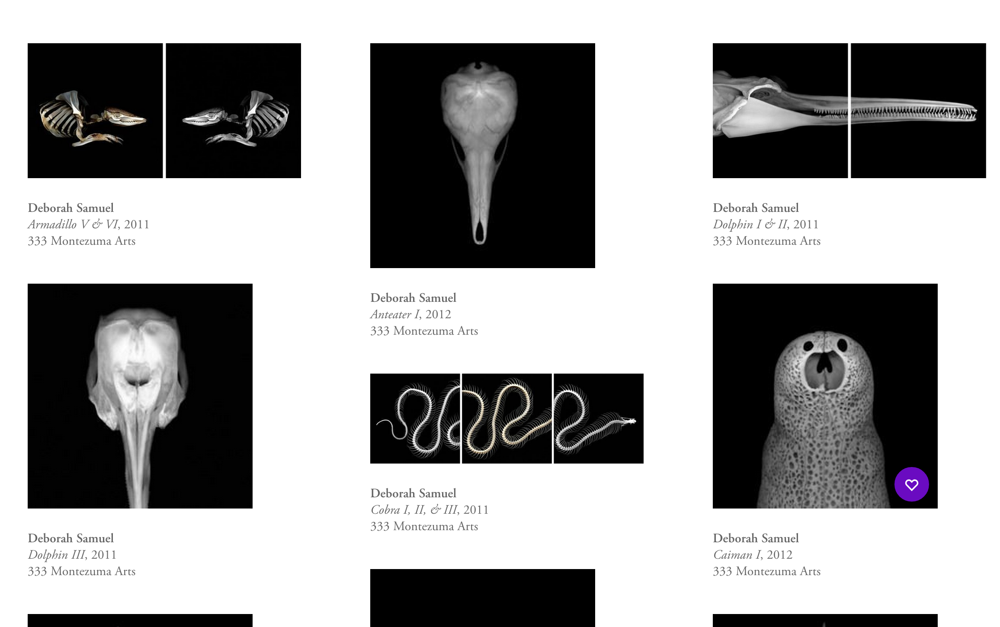

Dependencies:
- Artwork Item Component `components/artwork_item`

There are two different ways you can use the Artwork Columns component. It has a template and a view.
  1. Pass models to the template yourself
  2. Use the `ArtworkColumnsView`

#### Pass models to the template yourself
Include the template, and the artwork item save controls.
The template can be rendered with items that are already sorted with the results of an `Artworks`
collection's `groupByColumnsInOrder` method. This returns the models ready to go to pass to the template.

```jade
# Dependencies for the view
Artworks = require '../../../collections/artworks.coffee'
Backbone = require 'backbone'
CurrentUser = require '../../../models/current_user.coffee'
SaveControls = require '../../../components/artwork_item/save_controls.coffee'
artworkColumnsTemplate = -> require('../../../components/artwork_columns/template.jade') arguments...

# When the view has artworks to render
@$('.show-artworks').html artworkColumnsTemplate artworkColumns: artworks.groupByColumnsInOrder(3)

# Set up the save controls on each rendered artwork item and sync with the server
# Fillwidth rows and artwork columns do this on their own when rendering artwork items
listItems =
  for artwork, index in artworks.models
    overlay = @$(".artwork-item[data-artwork='#{artwork.get('id')}']").find('.overlay-container')
    new SaveControls
      artworkCollection: @artworkCollection  # This is the current user's saved artworks collection,
                                             # which is a model...
      el: overlay
      model: artwork
if @artworkCollection
  @artworkCollection.addRepoArtworks @collection
  @artworkCollection.syncSavedArtworks()
```

Note that the template will need to got in a containing element with a class of `.artwork-columns` to get
some of the default styling.

#### Use the `ArtworkColumnsView`
Benefits:
- Alternate column balancing layout (default option) where artworks are added to the shortest column
- Paging - the view allows you to add arrays of models and they will be rendered and initialized with save controls
- See more option to reveal more works
```coffeescript
  @columnsView = new ArtworkColumnsView
    el: @$ '.artwork-columns'
    collection: new Artworks @saleArtworks.pluck('artwork')
    gutterWidth: 40
    totalWidth: 1000 # Desired width of the container
    seeMore: false    # If true, will look at `initialItemCount`
                      # and hide / reveal any more than that value
    isOrdered: false  # If false will add artworks to the
                      # shortest column (left to right) to balance columns
    maxArtworkHeight: 400  # used to avoid tall works from spanning the
                           # whole view port and looking too large
```
Downsides are currently that this will inject a lot of CSS, so we may need to kill that or add more
params for percentage width / fluid layouts.


## Artwork Item
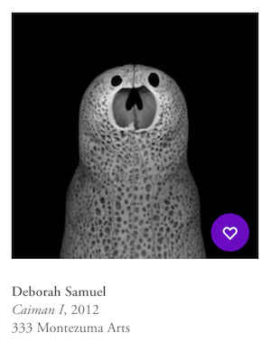

AKA "ol' reliable", this view is a work horse and will have a place on any page
that displays artwork. This component contains the save controls template and view.


## Garamond Tab List
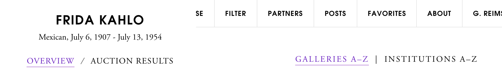
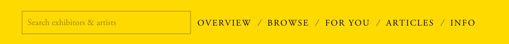

Defined in `components/main_layout/stylesheets/navigation.styl`
Example:
```jade
.garamond-tablist
  a.garamond-tab.is-active( href="/artist/#{artist.id}" ) Active Tab
  span.garamond-tab-separator
  a.garamond-tab( href="/artist/#{artist.id}" ) Inactive Tab
```
The tab seperator will add a slash as an image. Can alternatively be used with
other seperators typically wrapped in a span (to keep links displayed inline).

##### Uses:
- Fair [/arco-madrid-2016](http://artsy.net/arco-madrid-2016)

## Garamond Bordered Tab List
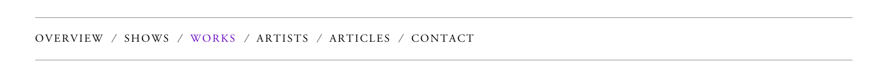


Defined in `components/main_layout/stylesheets/navigation.styl`
Example:
```jade
.garamond-bordered-tablist
  a.garamond-tab.is-active( href="/artist/#{artist.id}" ) Active Tab
  span.garamond-tab-separator
  a.garamond-tab( href="/artist/#{artist.id}" ) Inactive Tab
```
Like Garamond Tab List, but with borders on top and bottom.

##### Uses:
- Partner Profiles [/guggenheim](http://artsy.net/guggenheim)
- Artist Profiles [/jeff-koons](http://artsy.net/jeff-koons)

## Profile Badge
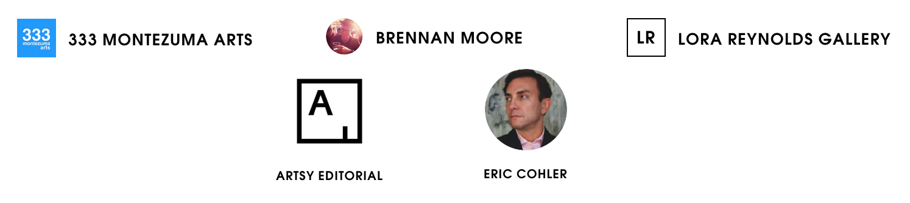

This component displays linked profile icons with a profile owner's name. Different
sizes and orientations can be achieved with CSS. If a common size / style setup emerges,
it should be added to `components/profile_badge/index.styl`.

```jade
unless profile.isNew()
  .artist-related-post-profile
    include ../../../components/profile_badge/template
```
Add a reference to the component's stylus file in the app's asset package and override
as needed.

```stylus
@require '../components/main_layout/stylesheets'
@require '../components/modal'
@require '../components/feedback'
@require '../components/auth_modal'
@require '../components/fillwidth_row'
@require '../components/tooltips'
@require '../components/profile_badge' // <-- ref to the component stylus
@require '../apps/artist/stylesheets'
```
See `apps/artist/stylesheets/index.styl` for an example of a customized layout
```stylus
.artist-related-post-profile
  text-align center
  vertical-align middle
  width 150px
  .profile-badge-icon
    display inline-block
    width 72px
    height 72px
  .profile-badge-name
    font-size 10px
    text-align center
```
##### Uses:
- Artist Pages - Featured Articles [/artist/andy-warhol](http://artsy.net/artist/andy-warhol)
- Partner Shows [/show/333-montezuma-arts-elegy](http://artsy.net/show/333-montezuma-arts-elegy)

## Suggested Genes
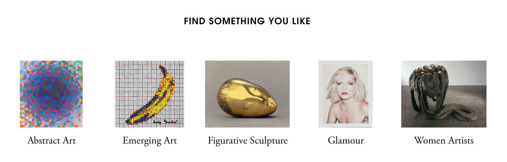

This component fetches and displays suggested genes in rows. `numberOfItems`
 (default to `5`) and `isShuffle` (default to `true`) options can be
passed when creating an instance. It has to call `render()` explicitly
to show the component.

Example
```jade
SuggestedGenesView = require '../../../components/suggested_genes/view.coffee'

(new SuggestedGenesView
  el: @$('.suggested-genes')
  numberOfItems: 10
  isShuffle: false
).render()
```

##### Uses:
- Favorites
- Follows

## Follow Button

Used in many pages that you can "follow" like the gene page, artist page, etc.

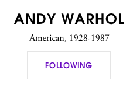
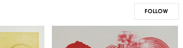

Example:
```coffeescript
{ Following, FollowButton } = require '../../components/follow_button/index.coffee'

following = new Following null, kind: 'artist'

new FollowButton
   el: $('.my-follow-button')
   following: following
   model: myModel
   modelName: 'artwork'

following.syncFollows myIds
```

Optionally you can pass in an `analyticsFollowMessage` and `analyticsUnfollowMessage` to the view. This falls back to a sensible default: `"#{action} #{@model.constructor.name.toLowerCase()} from #{window?.location.pathname}"`

## Artist Fillwidth List

Used in related artists for the artist page and the gene page where there's a fillwidth row of artists.

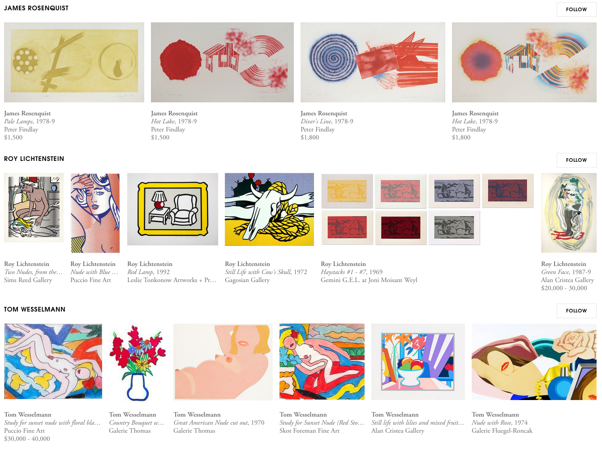

Example:
```coffeescript
new ArtistFillwidthList(
  collection: artists
  el: $('container')
  user: CurrentUser.orNull()
).fetchAndRender()
```

`fetchAndRender` will fetch every artist's artworks and the individual list items will re-render as they sync.

## Bordered Pulldown

An Artsy styled drop down menu. This component comes with two parts

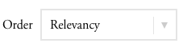

Include the jade mixin:

````jade
include ../../bordered_pulldown/mixin

+bordered-pulldown('Recently Added', 'Sort By')
  a( data-sort='date_created' ) Recently Added
  a( data-sort='-date_created' ) Artwork Year
````

Add the view:

````coffeescript
new BorderedPulldown el: $('.bordered-pulldown')
````

If you need finer control feel free to build your own html and just use the CSS classes. If you're doing server-side sorting the Backbone view isn't necessary.

## Filter

A library of components used in the multi-faceted fitler UIs across the site. E.g. in /browse and /gene/:id or /fair.

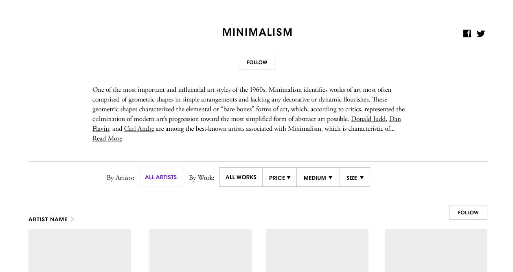

Currently the easiest way to use filter is to build on top of the FilterArtworks component detailed below. However if more control is needed you can use the smaller filter components listed below that to compose your own filter UI.

### Filter Artworks

A view that glues together a bunch of filter components and the artwork columns component to create a common filtering UI promonently used in gene, tag, and browse pages.

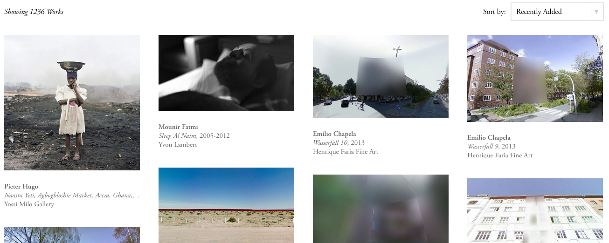

First build up your html using the classes shown below to indicate where the view will render it's pieces.

````jade
#tag-filter
  .filter-fixed-header-nav
    | Showing
    em.filter-artworks-num
    //- Add artwork filter buttons
    include ../../filter/artworks_nav
    //- You might append more controls in the header here
  .filter-artworks-list
  //- Here's where the columns of artworks with sort/count widgets render
````

Then add the view

````coffeescript
@filterView = new FilterArtworksView
  el: $ '#gene-filter'
  artworksUrl: "#{API_URL}/api/v1/search/filtered/gene/#{@model.get 'id'}"
  countsUrl: "#{API_URL}/api/v1/search/filtered/gene/#{@model.get 'id'}/suggest"
````

#### Building on top of it

It's recommended to extend this UI you build a parent view that uses this view as a child to build on top of it. If you find you need to add more to this view please consider composing your own filter UI out of the smaller components below.

#### How It Works

A filter UI generally consists of three things keeping state: 1. The filter query params passed to the endpoint being filtered on (e.g. /api/v1/search/filtered/tag/:id for tag artworks) 2. The counts being returned from a separate endpoint (e.g. /api/v1/search/filtered/tag/:id/suggest for tag artworks) 3. The collection of actual domain objects (e.g. an Artworks collection). This view creates these pieces for you as `@filterArtworksView.params`, `@filterArtworksView.counts`, and `@filterArtworksView.artworks` and passes them along to the sub components listed below. The sub components then listen to events on these state-keeping pieces and update their UI as needed.

### Filter Artworks Nav

The set of filter menus for artworks including the "All Works" button and "Price", "Medium", and "Size" dropdowns.

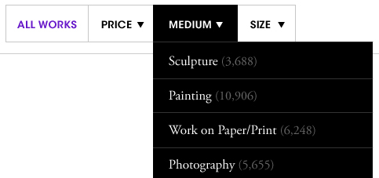

Include the template

````jade
#gene-artworks-container
  include ../../../components/filter/artworks_nav/template
````

Then add the view passing in the counts and params

````coffeescript
new FilterArtworksNav
  el: $ '#tag-filter-artworks-nav'
  params: #...
  counts: #...
````

Clicking nav items will set properties on the params e.g. clicking "Under $1000" will do `@params.set price_range: "-1:1000"`

### Filter Sort Count

A common subheader in the filtering UIs. This includes a sorting pulldown on the right which comes with the default "Recently Added", "Artwork Year Asc/Desc" sort values.

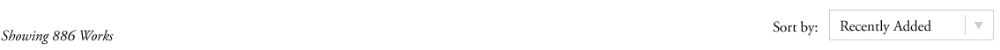

````coffeescript
new FilterSortCount
  el: $ '#gene-filter-subheader'
  params: #...
  counts: #...
````

Selecting a drop down item will set properties on the params e.g. clicking "Recently Added" will do `@params.set sort: '-created_at'

### Filter Fixed Header

A view that turns an element into a fixed header by wrapping it in a `.filter-fixed-header-container` element that pop-locks by toggling the class `.filter-fixed-header` on the container. You can use this class to adjust your header CSS by scoping under it e.g. `.filter-fixed-header #gene-filter-nav`.

Other responsibilites include:

* Adding a "jump" component which lets the user scroll back to the top of the page.
* Toggling the active buttons. (Clicking on a `.filter-buton` or `.filter-dropdown a` will turn off `.is-active` on other `.filter-button` or `.filter-dropdown` classes.)

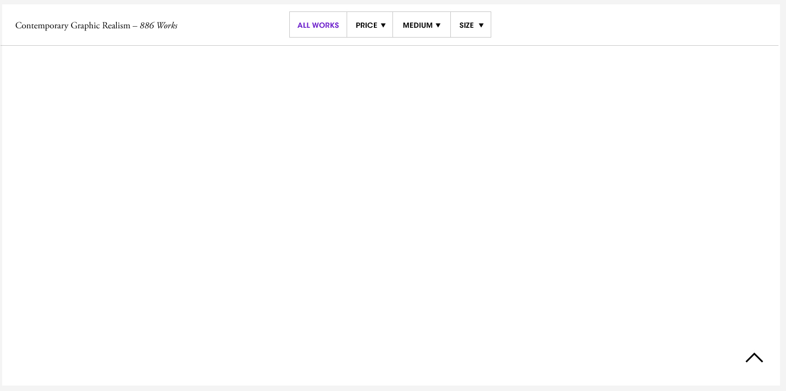

````coffeescript
new FilterFixedHeader
  el: $ '#gene-filter-header'
````

* Use the `.filter-fixed-header-left` class in your template to get the meta information on the left hand side such as gene name or number of works.

### Filter Nav

In the case where you want to build your own query params backed navigation (such as exhibitor filtering in fairs) you can use the FilterNav view to manage state.

````coffeescript
new FilterNav
  el: @$('.filter-fixed-header-nav')
  params: @params
  # When @params doesn't contain these attributes highlight .filter-nav-all (e.g. "All Works")
  highlightAllAttrs: ['price_range', 'dimension', 'medium']
````

`@params` is a Backbone model that stores filter query params like `related_genes=Painting`. This view will listen to changes on `@params` and update filter dropdown/button (see below) active states. It will also set attributes on `@params` which your list view UI can listen to and update. This is what the filter artworks component does so you can use that as reference.

Use the `.filter-nav-all` class to indicate a button that represents "show all of the things" such as "All works" or "All Exhibitors.

### Filter Dropdowns & Buttons

When building up your own filtering UI you may need to use buttons and dropdowns. To do so please use the filter components classes and jade mixin. The active states of these will be managed by the "Filter Fixed Header" component.

````jade
.filter-fixed-header-nav
  .filter-button.is-active All Exhibitors
  +filter-dropdown('Section', 'Sections', 'sector', { '...': '...' })
  include ../../../components/filter/artworks_nav/template
  .filter-button All Artists
````

## Contact View

```coffeescript
ContactView = require '../../components/contact/view.coffee'
new ContactView(width: '600px', url: "#{sd.API_URL}/api/v1/feedback")
```
The base `ContactView` is configurable by passing in the following options: `width` (modal width, String value in px), `successMessage` (large copy that is displayed after a successful message is sent), `placeholder` (Main textarea placeholder), `url` (API endpoint that data is posted to).

More useful is to extend the `ContactView` when configuration is more complex. The template for the header is a method that can be replaced with your own template function:

```coffeescript
_ = require 'underscore'
sd = require('sharify').data
ContactView = require './view.coffee'
headerTemplate = -> require('./templates/feedback_header.jade') arguments...

module.exports = class FeedbackView extends ContactView
  headerTemplate: headerTemplate
  defaults: -> _.extend super,
    placeholder: 'Leave your comments'
    url: "#{sd.API_URL}/api/v1/feedback"
```

The view's `submit` method can be intercepted to add more data to the model:

```coffeescript
  submit: ->
    @model.set
      artwork: @artwork.id
      contact_gallery: true
      session_id: SESSION_ID
    super

```

## Partner Buttons

Buttons used for common actions among partners such as following them or contacting them for a show inquiry.

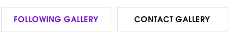

Use the `PartnerShowButtons` view and template to easily drop in the "Follow Gallery" and "Contact Gallery" buttons pictured above.

````jade
include ../../components/partner_buttons/show_buttons
````

````coffeescript
new PartnerShowButtons
  el: @$(".partner-buttons-show-buttons")
  model: @show
````

By default this view will figure out state of the "Follow Gallery" button. However, if you have many following buttons on one page and you want to batch update them at one to reduce API requests, feel free to pass them in yourself and call `syncFollows` when you're ready.

````coffeescript
@followProfiles = @user and new FollowProfiles
new PartnerShowButtons
  el: @$(".partner-buttons-show-buttons")
  model: @show
  followProfiles: @followProfiles
@followProfiles?.syncFollows [@show.get('partner').default_profile_id]
````

## Location Search

An autocomplete input that leverages the Google Maps API to get a geocoded location from a user that types in a city.


Check out usage in `apps/personalize`

## Page Modal

Fetches and displays a page of markdown content in a modal window

```stylus
@require '../apps/page'
```

```coffeescript
ModalPageView = require '../../../components/modal/page.coffee'

# ...

# Pass a width and a pageId
new ModalPageView
  width: '700px'
  pageId: 'auction-info'
```

## Flash Message

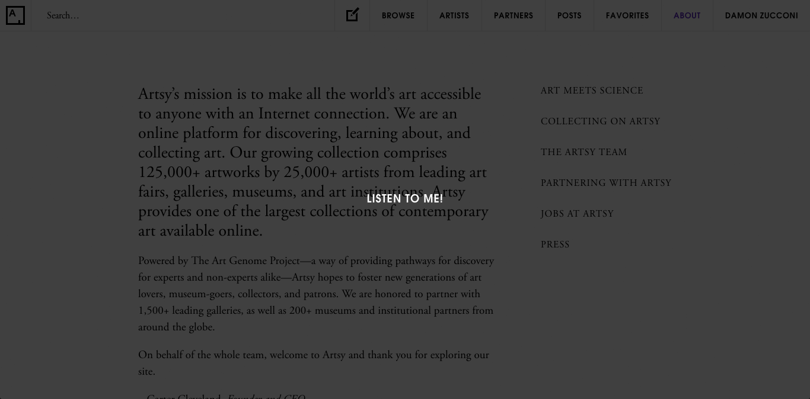

### Client-side usage:

```coffeescript
FlashMessage = require '../../../components/flash/index.coffee'

# ...

new FlashMessage message: 'Listen to me!'
```

or to display flash message on the next full pageload:

```coffeescript
$.post('/flash', message: 'Thank you for personalizing your profile')
```

### Server-side usage:
```coffeescript
req.flash 'info', 'Hello world.'
```

## Zig-Zag Banner


Add `@require '../components/zig_zag_banner'` to the relevant asset package and:

```coffeescript
ZigZagBanner = require '../../../components/zig_zag_banner/index.coffee'

# ...

new ZigZagBanner
  persist: true # Creates a cookie that persists for a year (defaults to true)
  name: 'inquiry' # Used in naming the cookie (so that multiple banners can exist)
  message: 'Interested in this work? Request more info here'
  $target: $inquiryButton # Gets vertically centered to the left of this DOM node
  backwards: false # Renders the banner from left to right
```

## Blurb
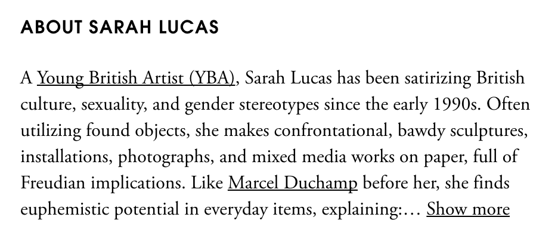

Blurb view using [jQuery dotdotdot](https://github.com/BeSite/jQuery.dotdotdot).

Example
```coffeescript
BlurbView = require '../../../components/blurb/view.coffee'

new BlurbView
  el: @$('.artist-blurb')
  updateOnResize: true
  lineCount: 4
```

##### Uses:
- artist
- partner profile (artist tab)

## Form Mixin

``` coffeescript
Form = require '../../components/mixins/form.coffee'

class FormView extends Backbone.View
  _.extend @prototype, Form

  events:
    'click button': 'submit'

  submit: (e) ->
    return unless @validateForm()
    return if @formIsSubmitting()

    e.preventDefault()

    @model.save @serializeForm(),
      success: (model, response, options) =>
        @reenableForm()
        # ...
      error: (model, response, options) =>
        @reenableForm()
        $('#my-error-div').html @errorMessage(response)
        # ...

```

You will want to have an actual `<button>` element in the form for handling submission. (The default `type` attribute is `submit` so this will trigger the form submission event.) `validateForm` will only apply the `is-validated` class to the form when there's a submit button due to click events firing before form submission events. You also want to prevent the default form event *after* calling `validateForm`.

## Related Links

Use it with a pre-existing collection. Pass in a `displayKey` for the link textual label and a `displayValue` for the href. Default `displayKey` is 'name', `displayValue` is 'href'. The view will check if those are functions before trying to pluck them as attributes.


``` coffeescript
RelatedLinksView = require '../../components/related_links/view.coffee'

# ...

@relatedLinksView = new RelatedLinksView collection: @collection, displayKey: 'name', displayValue: 'id'
@relatedLinksView.render()

# @relatedLinksView.$el.html()
# => <div><a href="pop-art1">Pop Art</a>, [...]</div>
```

Extend the view with custom templates and collection setup: The `wrapperTemplate` is provided with `links`, a comma separated list of `<a>` tags.

``` coffeescript
RelatedLinksView = require '../../components/related_links/view.coffee'

# ...

class Representation extends Backbone.Model
  href: ->
    "/#{@get('partner').default_profile_id}"

  name: ->
    @get('partner').name

class RelatedRepresentationsLinksView extends RelatedLinksView
  headerTemplate: _.template '<h2>Gallery Representation</h2>'
  wrapperTemplate: _.template '<div class="related-represenations-links"><%= links %></div>'

  initialize: (options = {}) ->
    @collection = new Backbone.Collection [], model: Representation
    @collection.url = "#{API_URL}/api/v1/artist/#{options.id}/partner_artists"
    @collection.fetch()
    super
```

## Split Test

Add the test configuration to the `./components/split_test/running_tests.coffee` file:

``` coffeescript
module.exports =
  header_design: # Key to reference when initializing the test
    key: 'header_design'
    outcomes: # Test group outcomes that add up to 1.0
      old: 1/2
      new: 1/2
    edge: 'new' # Functionality that is always deployed to admins
```

Initialize the test:

``` coffeescript
splitTest = require '../../components/split_test/index.coffee'

headerTest = splitTest('header_design')
headerTest.key() # => 'split_test--header_design' (a namespaced key used for cookie / Mixpanel)
headerTest.outcome() # => 'new' || 'old'
headerTest.cssClass() # => 'is-splittest-header_design--new' || 'is-splittest-header_design--old'
```

## Filterable List

``` coffeescript
FilterableListView = require '../../components/filterable_list/view.coffee'
```

``` coffeescript
class PressListView extends FilterableListView
  # Use your own templates by sub-classing and overwriting template functions

  # filtersTemplate
  # itemsTemplate
  # headerTemplate
  # itemTemplate

  # Return a string or pass on to a normal template
  itemTemplate: ({ item, filter_by }) ->
    """
      <!-- Ensure there is a `.filterable-list-item` class wrapper + a data-value -->
      <div class='filterable-list-item' data-value='#{item.get filter_by}'>
        #{item.get 'name'}
      </div>
    """
```

``` coffeescript
view = new FilterableListView
  collection: @collection
  group_by: 'year' # Optional
  filter_by: 'type'
  filters:
    # Value -> Label
    catalogue: 'Exhibition Catalogues'
    review: 'Exhibition Reviews'
    interview: 'Interviews'
    monograph: 'Monographs'
    biography: 'Biographies'

$('body').html view.render().$el
```
