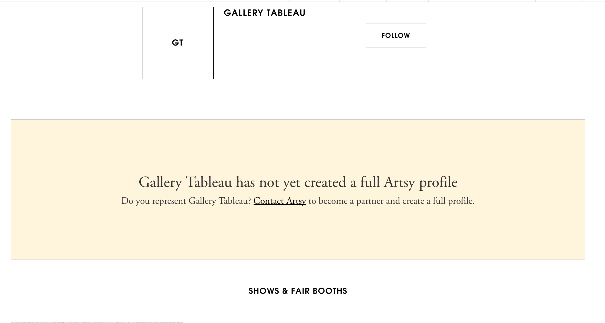
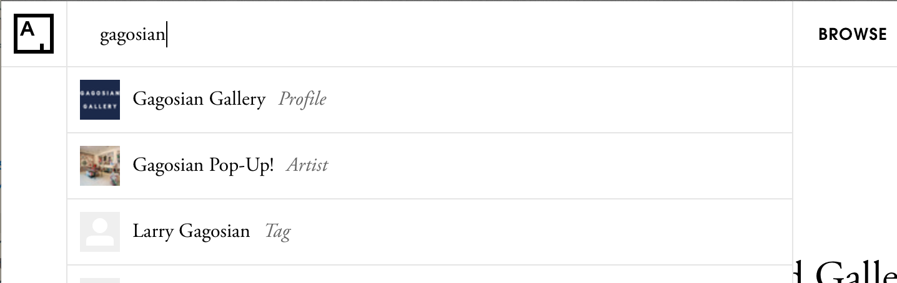

# Partner Support

This document will help web team engineers address partner requests
related to their partner profile pages.

## Displaying Partners on Artsy.net

Partners have several boolean flags that effect if and how they are presented.

### `partner.claimed` (default: `true`)

If `false`, the profile page will render the unclaimed banner. A partner is unclaimed
if they have a `contract_type` (a private field) of "Fair".




### `partner.has_full_profile`

If `true`, published / public partners will be listed on [artsy.net/galleries](http://artsy.net/galleries)

Note: that Instituion Partners listed on [artsy.net/institutions](http://artsy.net/institutions) are
managed by an ordered set.

### `partner.profile.published`

If `true`, the partner profile will show up in search.



### `partner.profile.private`

If `true`, visiting the profile handle will result in a 404 page.

__________________________________

## Artist Artworks Sorting

We get a lot of requests to sort partner artists' artworks. This is on
the product team's radar, but currently not supported. 
Works are sorted by the date they were created (`created_at`). 

If there is an emergency, we can mess with the creation dates via console
(ask Dylan or Gib).


## Missing Tab(s) and or Data

Stale or missing tabs from a profile page is a common issue. Partner artists
are created through artworks. This task is expensive and offloaded to a 
delayed job. For a single partner, it's safe to force some updates via console.

The Force project is defensive about making requests even if the partner counts
don't expect there to be any results for artists, shows, works, etc.

[Updating partner counts](https://github.com/artsy/gravity/blob/master/app/models/domain/partner.rb#L214) 
and invalidating caches will usually get things rendering as expected.
```ruby
profile = Profile.find 'profile-handle'
partner = profile.owner

# If an artist or artists are missing, the partner artist may have not been 
# created yet. Find each missing artist and create the partner artist
# (yes, it's from the Artwork!)
artist = Artist.find('artist-slug')
Artwork.update_partner_artist(partner, artist)

# See https://github.com/artsy/gravity/blob/master/app/models/domain/partner.rb#L214
# for what is updated: displayable shows, published artworks, artists, etc.
partner.update_counts!

# Invalidate garner caches to get the freshed data to the API
partner.invalidate_garner_caches
profile.invalidate_garner_caches
```
