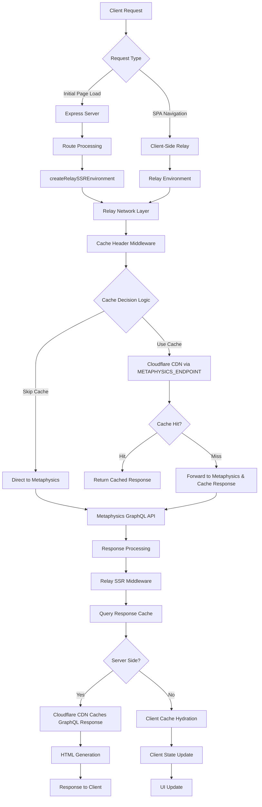
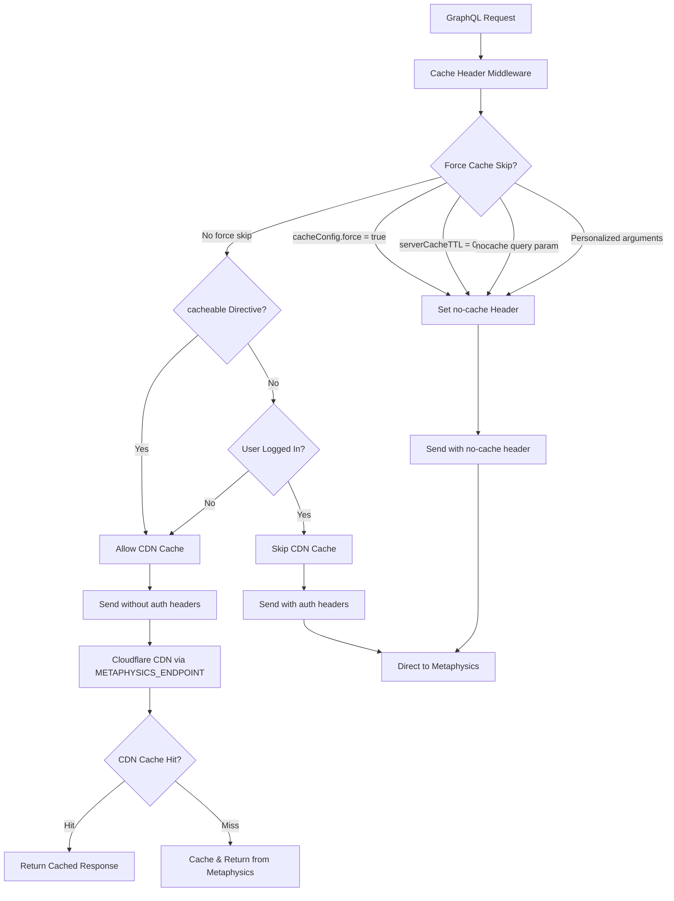
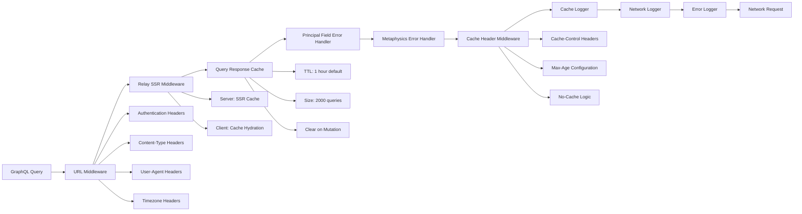
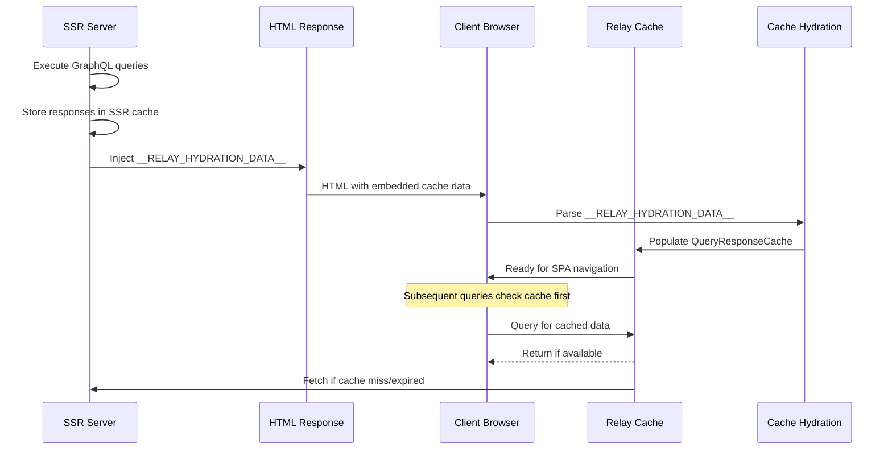
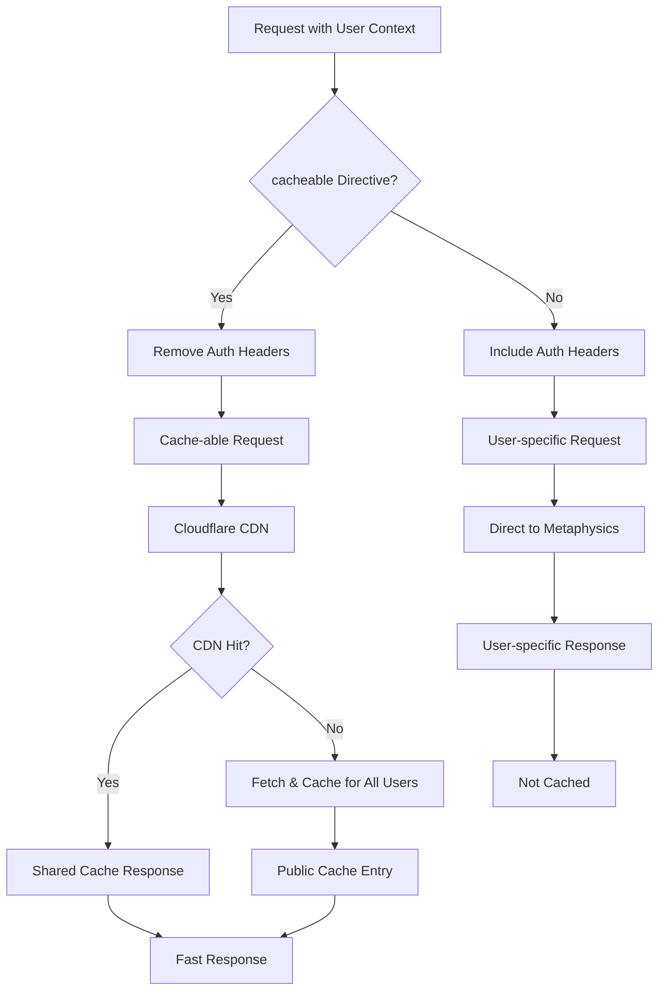

# Force Caching Architecture

Force implements a sophisticated multi-layer caching strategy that operates at both the Relay network level and the Cloudflare CDN level. This caching architecture is designed to optimize performance while respecting user authentication states and data freshness requirements.

## Cache Flow Overview

## Cache Decision Logic

The caching strategy uses sophisticated middleware to determine whether requests should be cached:

## Relay Network Middleware Stack

The Relay environment is configured with a sophisticated middleware pipeline:

## Cache Hydration Flow

During client-side hydration, cached data from SSR is transferred to the client:

## Authentication and Cache Interaction

The caching system handles authentication states intelligently:

## Metaphysics CDN Configuration

Force is configured to use Metaphysics CDN endpoints through the `METAPHYSICS_ENDPOINT` environment variable:

- **Staging**: `METAPHYSICS_ENDPOINT=https://metaphysics-cdn-staging.artsy.net`
- **Production**: `METAPHYSICS_ENDPOINT=https://metaphysics-cdn-production.artsy.net`

When the endpoint is set to a CDN URL, **all GraphQL requests** (both server-side during SSR and client-side during SPA navigation) are routed through Cloudflare first. Cloudflare caches the Metaphysics GraphQL responses keyed by GraphQL variables, providing significant performance improvements for cacheable queries.

### Client-Side Caching Behavior

Even in SPA mode, when the client makes requests via Relay to the network layer, those requests hit the Cloudflare CDN (when using the CDN endpoint). This means:

- Client-side navigation and data fetching benefits from CDN caching
- Cache hits return immediately from Cloudflare without hitting Metaphysics
- Cache misses are cached by Cloudflare for subsequent requests (from any client)

## Implementation Details

### Key Components

- **createRelaySSREnvironment** (`src/System/Relay/createRelaySSREnvironment.ts`): Sets up the Relay network layer with caching middleware
- **cacheHeaderMiddleware** (`src/System/Relay/middleware/cacheHeaderMiddleware.ts`): Determines cache behavior and sets appropriate headers
- **Cache Configuration**: Configurable via route-level `serverCacheTTL` and `cacheConfig` options

### Configuration Options

The caching system can be configured at multiple levels:

1. **Route Level**: Configure `serverCacheTTL` and `cacheConfig` in route definitions
2. **Query Level**: Use `@cacheable` directive for authenticated queries that can be cached
3. **Environment Level**: Set cache size (`GRAPHQL_CACHE_SIZE`) and TTL (`GRAPHQL_CACHE_TTL`)

### Cache Invalidation

- **Client-side**: Mutations automatically clear relevant cache entries
- **Server-side**: TTL-based expiration with configurable durations
- **Manual**: `?nocache=true` query parameter bypasses all caching layers

For detailed usage examples and configuration options, see [docs/caching.md](./caching.md).
