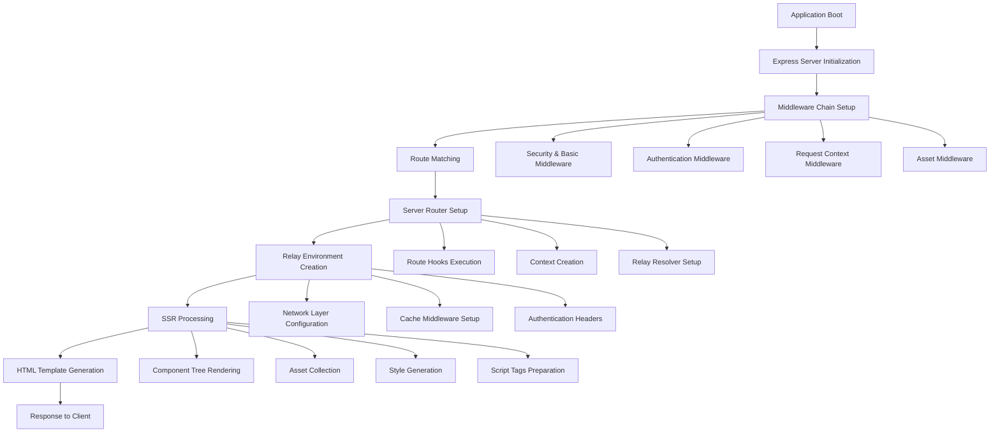
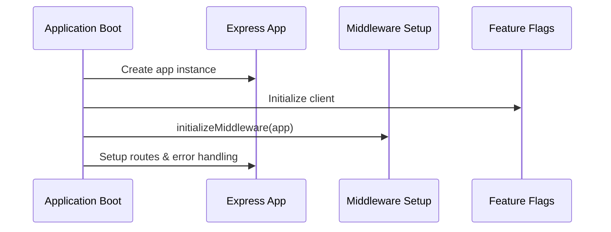
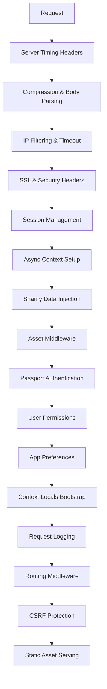
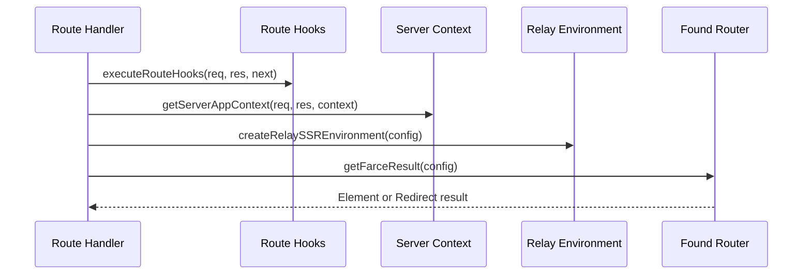
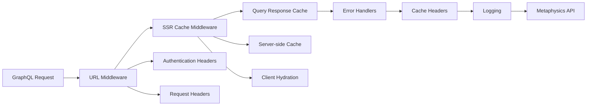
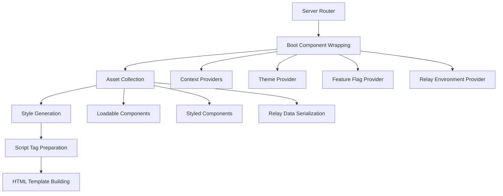
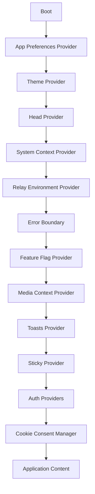
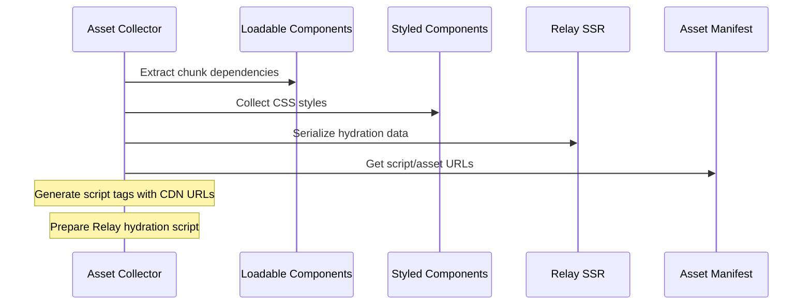
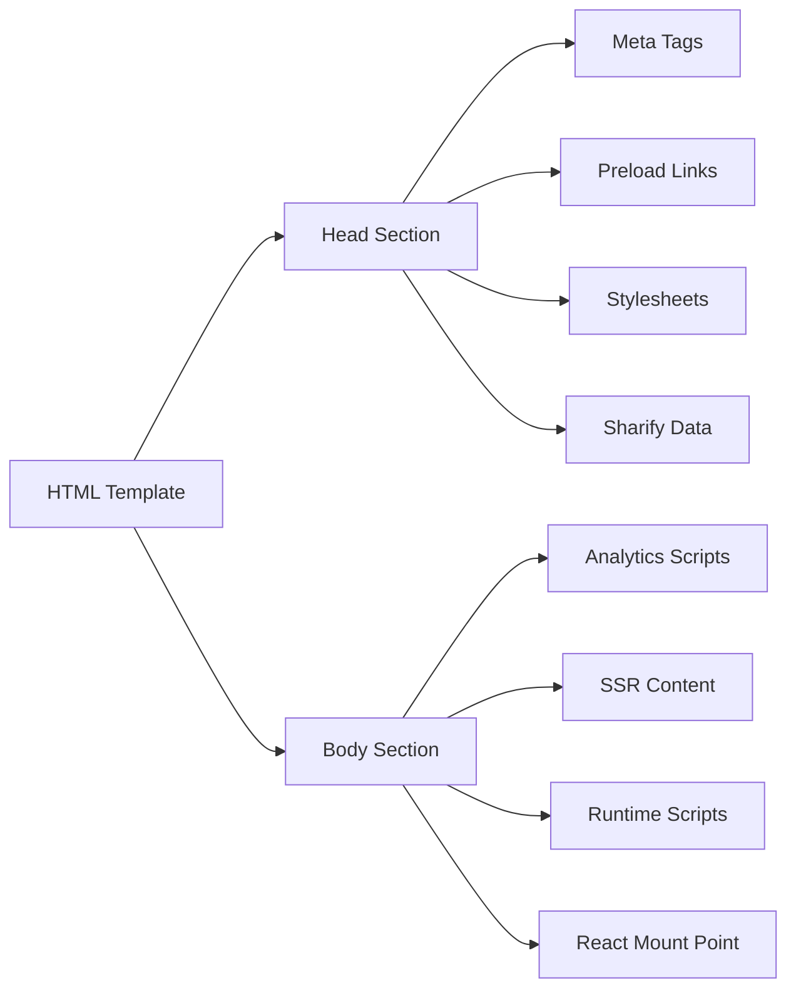
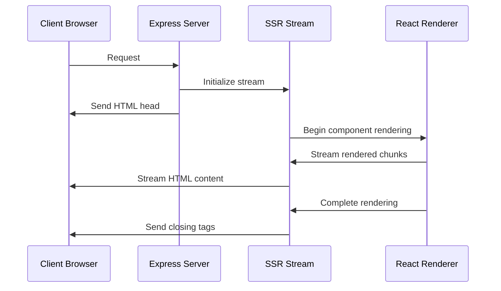

# Force Application Architecture

This document describes the control flow in the Force application, from boot to screen rendering, including Express middleware, Relay middleware, server-side rendering (SSR), and route rendering.

## Overview

Force is a React-based application with server-side rendering capabilities that runs on Node.js with Express. The application uses Relay for GraphQL data fetching and implements a sophisticated middleware chain for request processing.

## Architecture Flow

## Detailed Flow

### 1. Application Boot (src/server.ts)

The application starts by:

- Importing instrumentation for monitoring
- Creating an Express app instance
- Initializing the Unleash feature flag client
- Setting up middleware via `initializeMiddleware()`
- Configuring routes and error handling

### 2. Express Middleware Chain (src/middleware.ts)

The middleware chain processes requests in the following order:

Key middleware components:

- **Security**: SSL enforcement, HSTS, frame protection
- **Authentication**: Passport.js with multiple OAuth providers
- **Context**: Sharify for shared data, async locals for request context
- **Assets**: Static file serving and asset manifest handling

### 3. Route Processing & Server Router

When a route is matched, the application:

1. **Executes Route Hooks** (`executeRouteHooks`)
2. **Creates Server Context** (`getServerAppContext`)
3. **Initializes Relay Environment** (`createRelaySSREnvironment`)
4. **Sets up Routing** (Found.js with Farce)

### 4. Relay Middleware & Data Fetching

The Relay environment is configured with multiple middleware layers:

Key features:

- **Authentication**: Conditional header injection based on request cacheability
- **Caching**: Multi-layer caching with TTL and mutation invalidation
- **Error Handling**: Principal field errors and Metaphysics-specific error handling
- **SSR/Client Sync**: Cache hydration from server to client

### 5. Server-Side Rendering (SSR)

The SSR process involves several steps:

#### Boot Component Hierarchy (src/System/Boot.tsx)

The Boot component sets up the complete React context:

### 6. Asset Collection & HTML Generation

The asset collection process (`collectAssets`) handles:

### 7. HTML Template & Response

The final HTML template (`buildHtmlTemplate`) includes:

- **Head Section**: Meta tags, preload hints, CSS links
- **Body Section**: SSR content, script tags, React mount point
- **Optimization**: Resource preloading, CDN integration, font optimization

Streaming SSR (Disabled/Experimental)

When enabled (`ENABLE_SSR_STREAMING`), the application supports streaming server-side rendering. This feature is currently disabled and considered experimental.

## Configuration & Environment

The application behavior is controlled by various environment variables and configuration:

- **CDN_URL**: Asset CDN configuration
- **NODE_ENV**: Environment-specific behavior
- **ENABLE_SSR_STREAMING**: Streaming SSR toggle
- **SEGMENT_WRITE_KEY**: Analytics configuration
- **Feature flags**: Runtime behavior modification via Unleash

## Error Handling

Error handling occurs at multiple layers:

1. **Route level**: Try-catch in route handlers
2. **Middleware level**: Error handler middleware
3. **React level**: Error boundaries in Boot component
4. **Relay level**: Network and GraphQL error middleware

## Cache Flow Architecture

For detailed information about Force's caching architecture, see [architecture-caching.md](./architecture-caching.md).

This architecture ensures robust request processing from initial server boot through final HTML delivery to the client, with comprehensive caching, authentication, and rendering capabilities.
