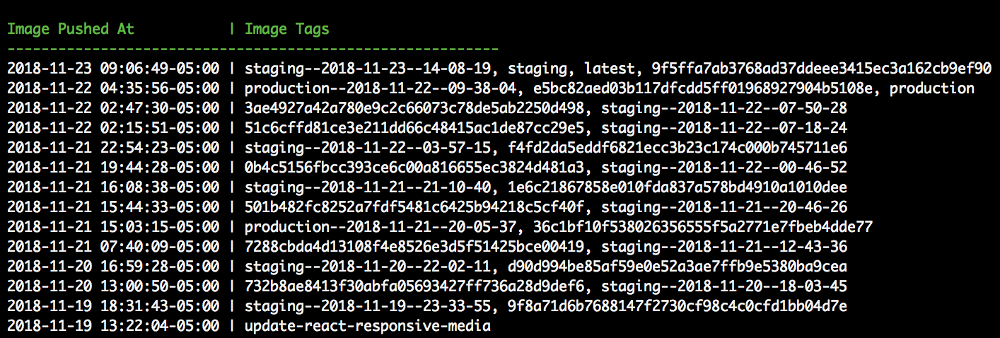
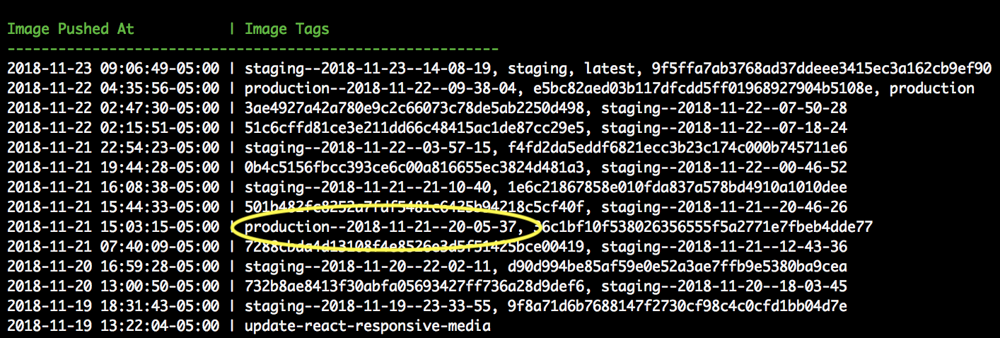
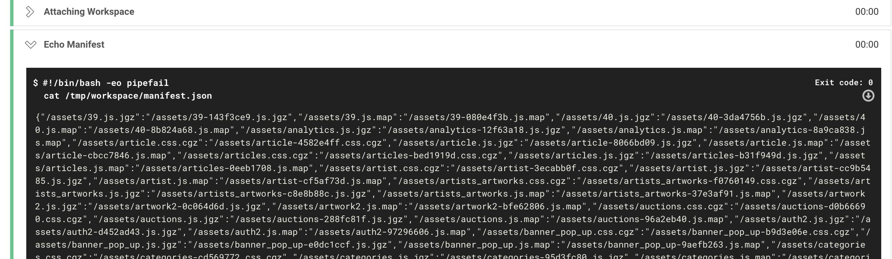

## How to Rollback (on Kubernetes, deployed w/ Hokusai)

So, you're reading this doc, in which case either nothing is on fire and you're simply educating yourself (yay!), or, there's a problem and you need to rollback Force. Take a deep breath, and read on.

1. Run `hokusai registry images`. You'll see output like the below.

2. Locate the name of a tag you want to deploy. In this case, since we're rolling back, it'll be the previous tag of the form `production-YYYY-mm-dd..`

3. Locate the Circle CI deploy process that corresponded to the deploy you are rolling back to. You may need to scroll back in the build history until you find it. One such example is: https://circleci.com/workflow-run/9fec809a-d096-4fc0-88b7-82419ada519d

4. Open up the final step, `deploy_hokusai_production`, and expand the 'Echo Manifest' step. This is a config variable that changes with each deploy, and needs to be set manually during the rollback.

5. Copy the long value into a text editor, and add single quotes around the entire thing. Then copy it to your clipboard.

6. Run the following command to set the config in the environment. `hokusai production env set ASSET_MANIFEST=...clipboard contents...`

7. When that completes, run the following command to deploy the desired image that you've located above. `hokusai production deploy production--2018-11-21--20-05-37`
