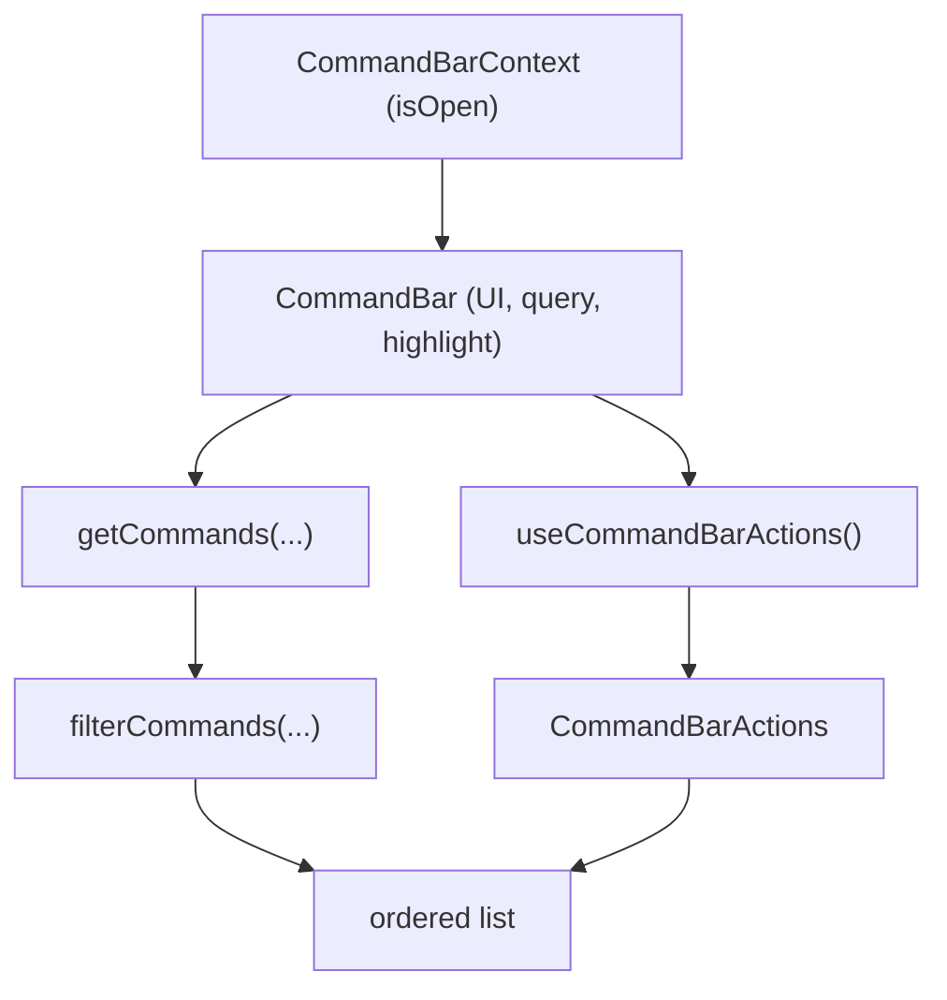

# Command Bar (⌘K)

A command palette for Artsy.net. Press **⌘K** (or **Ctrl+K**) anywhere to jump to
common destinations or run context-aware actions on the current page — à la
Linear / Notion / Superhuman.

Built for Hackathon 16.

## What it does

- **Navigation** — fuzzy-filter a static list of destinations (Search, Browse
  artists, Auctions, Saved works, Settings…) and jump straight there.
- **Context-aware actions** — on an artist page: _Follow this artist_ / _Create an
  alert_; on an artwork page: _Save this artwork_; everywhere: _Copy link_.
- **Free-text fallback** — typing a query offers "Search Artsy for '…'", which
  redirects to the existing `/search?term=` page.

## Scope decisions

These were settled up front and intentionally bound the build:

1. **Command palette, not search.** No live search results in the dropdown — the
   AUTOSUGGEST backend is deliberately out of scope. Free text redirects to the
   existing search page instead.
2. **No feature flag.** Always on for the hackathon build; gating is a ship-time
   concern only.
3. **Auth-gated destinations are hidden when logged out** (filtered by `isLoggedIn`).
4. **⌘K + a visible NavBar entry point.** The existing `/`-focuses-nav-search
   behavior is left untouched.
5. **Custom UI from Palette primitives**, hand-rolled keyboard nav — no `cmdk` /
   hotkey / fuzzy-match libraries added.
6. **Simple case-insensitive substring/token filter**, not fuzzy ranking.

## Architecture

The guiding principle is a **pure core with side effects pushed to the edge**, so
the command registry is trivially unit-testable.

| File                       | Responsibility                                                                                                                                                                                                                  |
| -------------------------- | ------------------------------------------------------------------------------------------------------------------------------------------------------------------------------------------------------------------------------- |
| `types.ts`                 | The `Command` shape and group ordering.                                                                                                                                                                                         |
| `getCommands.ts`           | **Pure.** Builds + filters the command list from `{ isLoggedIn, pathname, query, actions }`. Knows _what_ commands exist and when; knows nothing about routing/Relay. Side effects arrive via the injected `CommandBarActions`. |
| `useCommandBarActions.tsx` | Owns all side effects — router, Relay, toasts, auth dialog — and returns the `CommandBarActions` object `getCommands` calls.                                                                                                    |
| `CommandBarContext.tsx`    | Open/close state + the global keyboard listener (⌘K/Ctrl+K toggle, Escape close).                                                                                                                                               |
| `CommandBar.tsx`           | The overlay: portal, filter input, grouped list, ↑/↓/Enter/click nav. Renders `null` until opened.                                                                                                                              |

Data flow:

### Key choices & rationale

- **Pure `getCommands` + injected actions.** Keeps the registry a pure function of
  its inputs, so most behavior (auth filtering, contextual gating, search
  redirect) is covered by fast, mock-free unit tests. Only the thin action layer
  needs Relay/router mocking.
- **Slug → `internalID` resolved lazily.** Route params (`match.params.artistID` /
  `artworkID`) are slugs, but the follow/save mutations need `internalID`. Rather
  than pre-fetch on open, Follow/Save `fetchQuery` the entity on demand when the
  command actually runs — no work until it's needed.
- **Reuses existing mutations, not components.** `FollowArtistButton` /
  `useSaveArtworkToLists` are component-coupled, so the actions layer commits the
  same mutations directly via `useMutation`. Save is a **toggle** (saves, or
  removes if already saved) driven by `isSavedToAnyList`.
- **Logged-out actions fall back to the auth dialog** (`showAuthDialog` with the
  standard `afterAuthAction`), matching the rest of the app.
- **`navigate` calls `router.push`** via the Found router for client-side
  transitions without a full page reload.
- **`CommandBarProvider` is mounted in [`System/Boot.tsx`](../../System/Boot.tsx)**
  so the ⌘K keyboard listener is registered for the whole app. **`CommandBar`
  itself is rendered in [`Apps/Components/AppShell.tsx`](../../Apps/Components/AppShell.tsx)**,
  which is inside the Found router tree — giving it access to `RouterContext`
  (and therefore `router`, `match`, toasts, Relay, and auth-dialog). The overlay
  uses a portal to `document.body`, so its DOM position is independent of where
  it sits in the component tree.

## Extending

- **Add a destination:** append to `DESTINATIONS` in `getCommands.ts` (set
  `requiresAuth` if it needs login).
- **Add a contextual action:** add a route check in `getContextualCommands` and a
  matching side-effect function in `useCommandBarActions`.

## Tests

- `__tests__/getCommands.jest.ts` — auth filtering, contextual gating, search
  redirect, fuzzy filter (pure, no mocks).
- `__tests__/CommandBarContext.jest.tsx` — keyboard toggle + open/close.
- `__tests__/CommandBar.jest.tsx` — rendering, filtering, Enter/click execution.
- `playwright/e2e/commandBar.spec.ts` — ⌘K → type → navigate smoke test.

## Follow-ups (not in hackathon scope)

- Feature-flag the trigger + overlay before shipping.
- Analytics — `@artsy/cohesion` has no `ContextModule.commandBar` yet (auth-dialog
  intents currently use `navBar`).
